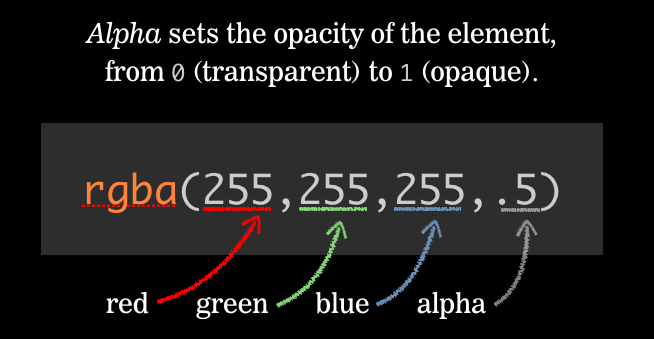

**WDI Fundamentals Unit 2**
---

#CSS Color

In this lesson, we'll learn about working with various CSS color and text methods to add flare to our websites! Check out the videos below before we dive into some code challenges!

<div class="wistia_responsive_padding" style="padding:56.25% 0 0 0;position:relative;"><div class="wistia_responsive_wrapper" style="height:100%;left:0;position:absolute;top:0;width:100%;"><iframe src="//fast.wistia.net/embed/iframe/2vazcm3j1l?seo=false&videoFoam=true" allowtransparency="true" frameborder="0" scrolling="no" class="wistia_embed" name="wistia_embed" allowfullscreen mozallowfullscreen webkitallowfullscreen oallowfullscreen msallowfullscreen width="100%" height="100%"></iframe></div></div>
<script src="//fast.wistia.net/assets/external/E-v1.js" async></script>

#### More on CSS Colors

While color names are fine when you're just beginning, there's a number of reasons you'll want to switch over to something more advanced. First, color names are rendered differently by different browsers. Secondly, there are only 147 color names accepted as standard, meaning your options are going to be pretty limited. Instead, you'll want to use either RGB or hexadecimal codes. Both of these are built on a system of entering values for the colors red, green, and blue.

By mixing different intensities of these three colors, you can create millions of different colors and shades. Intensity values range from 0 (no intensity) to 255 (full intensity) in the RGB system.In hex, they range from 0-9, then continue from A-F, with two characters each for red, green, and blue. This is clearer with examples, so here are some common colors with their RGB and Hex equivalents.

The format for color names, RGB, and hexadecimal should look like the following, respectively:

```css
p {
     color: red;
}

p {
     color: (255,0,0);
}

p {
     color: #FF0000;
}
```

#### Opacity

You'll use aplha to change the opacity of your element. See below:




---

#CSS Text Treatment

As you learn to style your website, you'll want to get more creative with the types of fonts you use as well as font size and much more! You'll also want to start aligning your text in your website to suit your needs! Let's explore how to do so!

<div class="wistia_responsive_padding" style="padding:56.25% 0 0 0;position:relative;"><div class="wistia_responsive_wrapper" style="height:100%;left:0;position:absolute;top:0;width:100%;"><iframe src="//fast.wistia.net/embed/iframe/mpderhu818?seo=false&videoFoam=true" allowtransparency="true" frameborder="0" scrolling="no" class="wistia_embed" name="wistia_embed" allowfullscreen mozallowfullscreen webkitallowfullscreen oallowfullscreen msallowfullscreen width="100%" height="100%"></iframe></div></div>
<script src="//fast.wistia.net/assets/external/E-v1.js" async></script>


#### More on CSS Text Treatment

**font-family**

To adjust the font of your selected text element, use the font-family property. For the value, enter the name of the font to which you’d like to alter your text. To be safe, try putting a comma after your selected font and enter a generic family as a fallback. If the web browser doesn’t support the font you selected, it will choose the fallback.

```html
h1 {
     font-family: Arial, sans-serif;
}
```

If your selected font is more than one word, capitalize both words and put them in quotation marks.

```html
h1 {
     font-family: "Courier New", monospace;
}
```

**font-size**

To increase or decrease the spacial dimensions of your chosen text, use the font-size property. As a beginner, you’ll want to enter pixel values for your font-size values.

```css
h3 {
     font-size: 24px;
}
```

As you become more advanced, try using percentages or ems instead of pixels. These can be pretty tricky, though, so you may want to wait until we cover them in Unit 9.


**font-weight**

To adjust the thickness of your selected text, use the font-weight property.

As a beginner, you can enter values like “normal” to make your text thin and “bold” to make your text thick. As these values aren’t very specific, different browsers may interpret their display with slightly different outputs.

```css
h1 {
     font-weight: normal;
}

h1 {
     font-weight: bold;
}
```

As you become more advanced, try using the numbers 100, 200, 300, 400, 500, 600, 700, 800, and 900 as values to gain more granular control. With this system, 400 is roughly equivalent to “normal” and 700 roughly equals “bold.”

```css
h1 {
     font-weight: 400;
}

h1 {
     font-weight: 700;
}
```

**font-style**

To make normal text italic, use the property font-style and the value “italic.” To reverse this effect, use the value “normal.”

```css
a {
     font-style: italic;
}

a {
     font-style: normal;
}
```

**text-align**

To adjust the positioning of a text element, use the CSS property text-align and one of the following values: left, right, center, or justify.

```css
body {
     text-align: center;
}
```

**text-decoration**

To add an underline to normal text, use the CSS property text-decoration and the value “underline.”

```css
h1 {
     text-decoration: underline;
}
```

To remove underlines, use the value “none.” This declaration is often applied to anchor tags.

```css
a {
     text-decoration: none;
}
```
Less commonly used values include “overline” to add a line above text and “line-through” which strikes a line through your text.

**text-transform**

To adjust capitalization in a selected text element, use the text-transform property.

Values for this property include “uppercase” to make every letter capitalized, “lowercase” to make every letter uncapitalized, and “capitalize” to make the first letter of every word in the selected text uppercase.

```css
h1 {
     text-transform: uppercase;
}
```

#### External Fonts

Did you know you can also link to external fonts in your HTML? Let's try it!

There are three parts to loading up a web font with HTML. The href tells the browser where the font is.

`<link href="http://fonts.googleapis.com/css?family=Open+Sans:400,800" rel="stylesheet" type="text/css">`

Here we want to open Sans font, in two weights: 400 for body text, and 800 for headings. The rest of this tells the HTML that the link goes to a CSS stylesheet. Follow the link to take a peek!

**Note**: For servers that live behind a login, you'll need to add an "s" to the http—tricking our servers into thinking the font is a protected file.


---

[On to the next lesson.](03_exercise.md)
